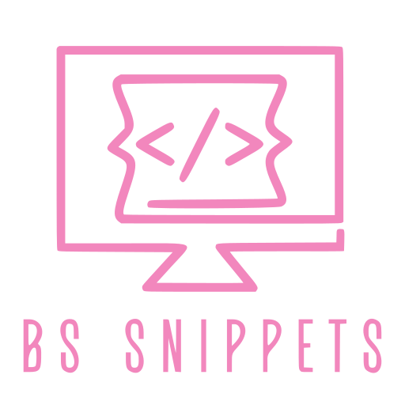

    

<h1 align="center">BS Interface</h1>

An extension developed to edit and save XML survey files. It is used alongside [x_m_l_M_n_sh Snippets](vscode:extension/
boodooa-monish.deciphersnips) to improve the workflow for scripting xml surveys.

## Basic Design

This extension stores all information on the user's device. It does so by creating a config file on the user's installed extension storage.

This config file includes:
- the saved api key
- the list of projects added

Import and Export Functionalities have been added to allow the user to use the same config file on different devices by exporting and them importing them on the other device.

## Requirements

This extension requires a survey api key work. Please contact your relevant parties to obtain access to the api key.

## Features

This extension features some basic survey editing functions typically used when scripting surveys:

- add/delete a project on the config's project list.
- basic search to find a relevant project
- add/test an api key
- import/export the config file
- set projects as favorite to pin them first in the order of the project list.
- go directly to the project portal using the project's hyperlink.

## Interface Guide

## Known Issues

- Avoid multi clicking on the fetch buttons when saving or add project. This can cause your api to get banned.
- Always wait for the fetch and save requests to complete before continuing. Information / Error Message Boxes have been add to inform you about the status of your requests.